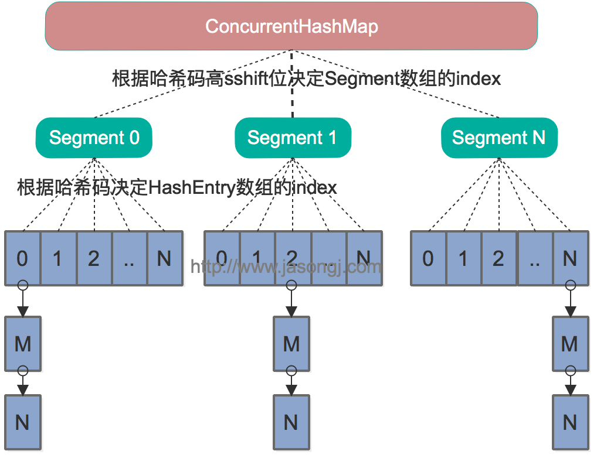

### 面试题
#### hashmap结构；什么对象能做为key
    不可变对象。
    因为：HashMap用Key的哈希值来存储和查找键值对。当插入一个Entry时，HashMap会计算Entry Key的哈希值。
    Map会根据这个哈希值把Entry插入到相应的位置。
    
    查找时，HashMap通过计算Key的哈希值到特定位置查找这个Entry。而可变对象可能会是hash值发生改变。

#### hashtable,concurrentHashMap,hashtable比较

* hashMap是线程不安全的 hashtable是线程安全的

* hashMap key和value都可以为null hashtable不行，所以hashMap不能使用get()判断null，应使用containsKey()

jdk 1.8后 HashMap的设计采用`数组+链表+红黑树`的形式。

什么时候扩容？

    - 1 当前容量超过阈值

    - 2 当链表中元素个数超过默认设定（8个），当数组的大小还未超过64的时候，此时进行数组的扩容，如果超过则将链表转化成红黑树

什么时候链表转化为红黑树？（上面已经提到了）

    - 当数组大小已经超过64并且链表中的元素个数超过默认设定（8个）时，将链表转化为红黑树

* 1 Hashtable中采用的锁机制是一次锁住整个hash表，从而同一时刻只能由一个线程对其进行操作,但是效率低

* concurrentHashMap在java7以前使用分段锁，java8放弃了分段锁

java7之前的结构图

这时只要锁住Segment下的hash表。
java8之后放弃了segment,采用`数组+链表+红黑树`的形式。

        改进一：取消segments字段，直接采用transient volatile HashEntry<K,V>[] table保存数据，采用table数组元素作为锁，
        从而实现了对每一行数据进行加锁，进一步减少并发冲突的概率。
        
        改进二：将原先table数组＋单向链表的数据结构，变更为table数组＋单向链表＋红黑树的结构。对于hash表来说，
        最核心的能力在于将key hash之后能均匀的分布在数组中。
        如果hash之后散列的很均匀，那么table数组中的每个队列长度主要为0或者1。但实际情况并非总是如此理想，
        虽然ConcurrentHashMap类默认的加载因子为0.75，
        但是在数据量过大或者运气不佳的情况下，还是会存在一些队列长度过长的情况，如果还是采用单向列表方式，
        那么查询某个节点的时间复杂度为O(n)；
        因此，对于个数超过8(默认值)的列表，jdk1.8中采用了红黑树的结构，那么查询的时间复杂度可以降低到O(logN)，
        可以改进性能。
        
[参考链接](https://my.oschina.net/pingpangkuangmo/blog/817973)

[参考链接](https://blog.csdn.net/wangxiaotongfan/article/details/52074160)

#### JAVA中的几种基本数据类型是什么，各自占用多少字节。

| 类型 | 存储需求|bit 数|取值范围|备注|
|----- |------ | ------ | ---| ----|
|int | 4字节 | 4*8 | -2147483648~2147483647 | 即 (-2)的31次方 ~ (2的31次方) - 1|
|short	|2字节|	2*8	|-32768~32767	|即 (-2)的15次方 ~ (2的15次方) - 1|
|long	|8字节|	8*8	|	|即 (-2)的63次方 ~ (2的63次方) - 1|
|byte|	1字节|	1*8|	-128~127	|即 (-2)的7次方 ~ (2的7次方) - 1|
|float|	4字节|	4*8	|	|float 类型的数值有一个后缀 F（例如：3.14F）|
|double|	8字节|	8*8	|	|没有后缀 F 的浮点数值（例如：3.14）默认为 double|
|boolean|	1字节|	1*8	|true、false|
|char|	2字节	|2*8	|	|Java中，只要是字符，不管是数字还是英文还是汉字，都占两个字节。|

#### String类能被继承吗，为什么。

    不能，为了String类被final关键字修饰。

#### String，Stringbuffer，StringBuilder的区别。

    * String：字符串常量，字符串长度不可变。每次重新赋值时，会生成新的对象。不适合使用于频繁修改场景。
    
    * StringBuffer 字符串变量（线程安全）。如果要频繁对字符串内容进行修改且考虑安全，最好使用StringBuffer。
    
    * StringBuilder 字符串变量（非线程安全）。如果要频繁对字符串内容进行修改且考虑效率问题，最好使用StringBuilder。

#### 讲讲类的实例化顺序，比如父类静态数据，构造函数，字段，子类静态数据，构造函数，字段，当new的时候，他们的执行顺序。

     父类静态代码块===》子类静态代码块===》父类构造方法====》子类构造方法

#### 有没有有顺序的Map实现类，如果有，他们是怎么保证有序的。

    JAVA在JDK1.4以后提供了LinkedHashMap来帮助我们实现了有序的HashMap！
    LinkedHashMap取键值对时，是按照你放入的顺序来取的。

#### 产生死锁的四个必要条件。
    互斥条件： 进程要求对所分配的资源（如打印机）进行排他性控制，即在一段时间内某资源仅为一个进程所占有。此时若有其他进程请求该资源，则请求进程只能等待。
    不可剥夺条件： 进程所获得的资源在未使用完毕之前，不能被其他进程强行夺走，即只能由获得该资源的进程自己来释放（只能是主动释放)
    请求与保持条件： 进程已经保持了至少一个资源，但又提出了新的资源请求，而该资源已被其他进程占有，此时请求进程被阻塞，但对自己已获得的资源保持不放。
    循环等待条件： 存在一种进程资源的循环等待链，链中每一个进程已获得的资源同时被 链中下一个进程所请求。
    
#### 产生死锁的四个必要条件。    

#### 类可以继承多个类么，接口可以继承多个接口么,类可以实现多个接口么。

    类是单继承，多实现。接口不能实现，只能多继承。

#### 继承、依赖、关联、聚合的区别在哪

    继承是把父类的的公共方法和参数拿到子类中使用，可重写父类方法，也可不重写，直接使用。

    依赖是一种使用关系。如
    public class Pen {
        public void write(){
            System.out.println("use pen to write");
        }
    }
    
    public class Me {
        public void write(Pen pen){//这里，pen作为Me类方法的参数
            pen.write();
        }
    }
    关联是一种结构关系，说明一个事物的对象与另一个事物的对象相联系。如
    public class You {
        private Pen pen; // 让pen成为you的类属性 
    
        public You(Pen p){
            this.pen = p;
        }
    
        public void write(){
            pen.write();
        }
    }
    聚合是关联的一种特例，把整个类的集合拿过来使用。如
    public class Family {
        private List<Child> children; //一个家庭里有许多孩子
    
        // ...
    }
    
#### 反射创建类实例的三种方式是什么。

    Class<?> mClass = ClassTest1.newInstance().getClass();
    Class<?> mClass = ClassTest1.class;
    mClass = Class.forName("com.xingen.classdemo.ClassTest1");
    
#### 反射中，Class.forName和ClassLoader区别 。

    java中class.forName()和classLoader都可用来对类进行加载。
    class.forName()前者除了将类的.class文件加载到jvm中之外，还会对类进行解释，执行类中的static块。

#### 描述动态代理的几种实现方式，分别说出相应的优缺点。

    jdk动态代理和cglib
    使用JDK动态代理，目标类必须实现的某个接口，如果某个类没有实现接口则不能生成代理对象。
    Cglib原理是针对目标类生成一个子类，覆盖其中的所有方法，所以目标类和方法不能声明为final类型。
    从执行效率上看，Cglib动态代理效率较高。

#### 深拷贝和浅拷贝区别。

    浅拷贝：对基本数据类型进行值传递，对引用数据类型进行引用传递般的拷贝，此为浅拷贝。
     
        public Object clone() {
            return super.clone();
        }Executor
    深拷贝：对基本数据类型进行值传递，对引用数据类型，创建一个新的对象，并复制其内容，此为深拷贝。
    
        public Object clone() {
            FatherClass cloneFacther = (FatherClass) super.clone();
            cloneFacther.child = (ChildClass) this.child.clone();
            return cloneFacther;
        }

#### error和exception的区别
    Exception（异常）是应用程序中可能的可预测、可恢复问题
    Error类一般是指与虚拟机相关的问题，如系统崩溃，虚拟机错误，内存空间不足，方法调用栈溢等。
    对于这类错误的导致的应用程序中断，仅靠程序本身无法恢复和预防
    
#### Redis数据类型及其底层实现方式
    Redis是由C语言编写的。Redis支持5种数据类型，以K-V形式进行存储，K是String类型的，V支持5种不同的数据类型，
    分别是：string，list，hash，set，sorted set，每一种数据结构都有其特定的应用场景。
    从内部实现的角度来看是如何更好的实现这些数据类型。Redis底层数据结构有以下数据类型：
    简单动态字符串（SDS），链表，字典，跳跃表，整数集合，压缩列表，对象。接下来，
[相关更多](https://www.despairyoke.com/2019/09/05/2019/2019-09-05-redis/)

#### 原码 反码 补码的区别和计算方式
    正数和0的原码、反码、补码 是它自己本身
    负数的原码是最高位为1表示负数
    负数的反码是正数的原码取反
    负数的补码是正数的原码取反 + 1
[相关更多](https://www.despairyoke.com/2019/09/23/2019/2019-09-23-byte/)

#### JVM 有哪些垃圾回收算法
    标记-清除算法
    复制算法
    标记-整理算法
    分代收集算法
[相关更多](https://www.despairyoke.com/2019/09/21/2019/2019-09-21-jvm/)