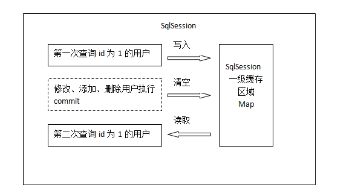
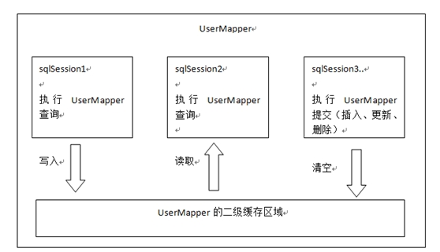
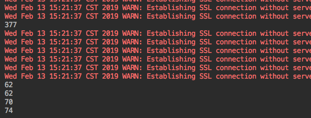

## 缓存使用场景及选择策略

### mybaitis缓存介绍

* mybatis一级缓存



Mybatis的一级缓存是指SqlSession。一级缓存的作用域是一个SqlSession。Mybatis默认开启一级缓存。
在同一个SqlSession中，执行相同的查询SQL，第一次会去查询数据库，并写到缓存中；第二次直接从缓存中取。
当执行SQL时两次查询中间发生了增删改操作，则SqlSession的缓存清空。

* mybatis二级缓存



Mybatis的二级缓存是指mapper映射文件。二级缓存的作用域是同一个namespace下的mapper映射文件内容，多个SqlSession共享。Mybatis需要手动设置启动二级缓存。

在同一个namespace下的mapper文件中，执行相同的查询SQL，第一次会去查询数据库，并写到缓存中；第二次直接从缓存中取。

当执行SQL时两次查询中间发生了增删改操作，则二级缓存清空。

## 使用效果
### 表创建
```sql
CREATE TABLE IF NOT EXISTS `test`.`user` (
  `id` INT(11) NOT NULL,
  `username` VARCHAR(45) CHARACTER SET 'utf8' COLLATE 'utf8_bin' NULL DEFAULT NULL,
  `password` VARCHAR(45) CHARACTER SET 'utf8' COLLATE 'utf8_bin' NULL DEFAULT NULL,
  PRIMARY KEY (`id`))
ENGINE = InnoDB
DEFAULT CHARACTER SET = utf8
COLLATE = utf8_bin
```
### 手动插入1000条数据
```sql
DROP PROCEDURE IF EXISTS proc_initData;
DELIMITER $
CREATE PROCEDURE proc_initData()
BEGIN
    DECLARE i INT DEFAULT 1;
    WHILE i<=1000 DO
        INSERT INTO test.user(username) VALUES('张三');
        SET i = i+1;
    END WHILE;
END $
call proc_initData();

```

### 一级缓存的使用

* 测试代码如下
```java
    @GetMapping(value = "/")
    public Long selectUser(String username) {

        long start = System.currentTimeMillis();

        List<User> user = userMapper.selectByusername(username);

        long end = System.currentTimeMillis();

        long count =end-start;

        System.out.println(count);

        return count;
    }
```
* 测试效果



从结果可以看到，当一直访问该接口，得到的结果是第一次查询时间为377ms，后续时间在60-80ms之间，可见mybatis一级缓存生效
* 在UserMapper中编写查询代码
```java
 Course selectByusername(String username);

```
* 编写测试代码

```java
    @Test
    public void test() {

        Course course = userMapper.selectByusername("zzz");

        System.out.println(course);
    }
```
* 测试结果


### 二级缓存

* 配置文件applicaiton.properties加入mybatis缓存配置
```properties
mybatis.configuration.cache-enabled=true
```
* *Mapper.xml加入<cache>
```xml
  <cache></cache>
```

* 测试结果


与上述结果对比，可以看出二级缓存比一级缓存速度要快了许多，也说明数据先到二级缓存中读取，如果没有再去一级缓存。

### 缓存的使用场景

通过上述描述，可见缓存用于查询较为平凡，增删改比较少的场景使用最为恰当。

### 选择策略

上述中有10000条数据，然而查询速度只有100ms一下，所以如果并发不高的情况下，建议使用一级缓存。