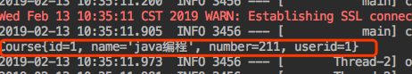

## mybatis关联查询

### 表结构展示和表创建


```sql
CREATE TABLE IF NOT EXISTS `test`.`user` (
  `id` INT(11) NOT NULL,
  `username` VARCHAR(45) CHARACTER SET 'utf8' COLLATE 'utf8_bin' NULL DEFAULT NULL,
  `password` VARCHAR(45) CHARACTER SET 'utf8' COLLATE 'utf8_bin' NULL DEFAULT NULL,
  PRIMARY KEY (`id`))
ENGINE = InnoDB
DEFAULT CHARACTER SET = utf8
COLLATE = utf8_bin
```
---------
```sql
CREATE TABLE IF NOT EXISTS `test`.`course` (
  `id` INT(11) NOT NULL AUTO_INCREMENT,
  `name` VARCHAR(45) CHARACTER SET 'utf8' COLLATE 'utf8_bin' NULL DEFAULT NULL,
  `number` INT(10) UNSIGNED NULL DEFAULT NULL,
  `userId` INT(11) NOT NULL,
  PRIMARY KEY (`id`),
  INDEX `fk_course_user_idx` (`userId` ASC),
  CONSTRAINT `fk_course_user`
    FOREIGN KEY (`userId`)
    REFERENCES `test`.`user` (`id`)
    ON DELETE NO ACTION
    ON UPDATE NO ACTION)
ENGINE = InnoDB
DEFAULT CHARACTER SET = utf8
COLLATE = utf8_bin
```
### 使用[mybatis-genetator](../mybatis-generator/README.md)自动生成实体和mapper文件

```xml
        <table tableName="user" domainObjectName="User"
               enableCountByExample="true"
               enableUpdateByExample="true"
               enableDeleteByExample="true"
               enableSelectByExample="true"
               selectByExampleQueryId="true"
        ></table>

        <table tableName="course" domainObjectName="Course"
               enableCountByExample="true"
               enableUpdateByExample="true"
               enableDeleteByExample="true"
               enableSelectByExample="true"
               selectByExampleQueryId="true"
        ></table>
```

### 手动插入数据
```sql
INSERT INTO `test`.`user` (`id`, `username`) VALUES ('1', 'zzz');

INSERT INTO `test`.`course` (`id`, `name`, `number`, `userId`) VALUES ('1', 'java编程', '211', '1');

```
### 使用关联查询

#### 通过username查询课程名

* 在UserMapper中编写查询代码
```java
 Course selectByusername(String username);

```

* 在对应的xml编写查询语句
```xml
  <select id="selectByusername" parameterType="java.lang.String" resultType="com.zwd.mybatis.linkquery.domain.Course">
    select * from course where userId = (select id from user where username = #{username, jdbcType=VARCHAR})
  </select>
```
* 编写测试代码

```java
    @Test
    public void test() {

        Course course = userMapper.selectByusername("zzz");

        System.out.println(course);
    }
```
* 测试结果



