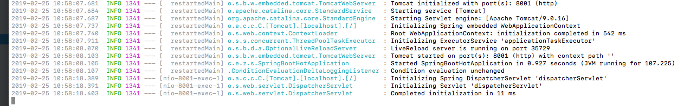
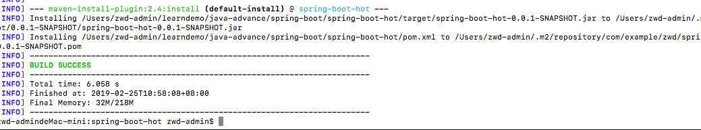

## springboot热部署

[官网连接](https://docs.spring.io/spring-boot/docs/current/reference/html/using-boot-devtools.html)

spring-boot-devtools 最重要的功能就是热部署。它会监听 classpath 下的文件变动，并且会立即重启应用。
```java
<dependency>
    <groupId>org.springframework.boot</groupId>
    <artifactId>spring-boot-devtools</artifactId>
    <optional>true</optional>
</dependency>

```
` <optional>true</optional>`true表示依赖不会传递。
如果，希望指定文件夹下的文件改变的时候，重新启动 Spring Boot，我们只要在 src/main/resources/application.properties 中配置信息。

    spring.devtools.restart.additional-paths= # Additional paths to watch for changes.
    
- 启动实例
```java
@SpringBootApplication
@RestController
public class SpringBootHotApplication {

	@Value(value = "${username}")
	private String name;

	public static void main(String[] args) {
		SpringApplication.run(SpringBootHotApplication.class, args);
	}

	@GetMapping(value = "/")
	public String index() {
		return "hello "+ name;
	}

}
```
- application.properties
```properties
server.port=8001
username=name

spring.devtools.restart.additional-paths=resources/application.properties
```
使用`mvn spring-boot:run`启动项目。


访问http://localhost:8001 响应信息如下

    hello name

保持项目启动，修改配置文件name改为其他(如：zwd)。打开一个新的命令行窗口，使用maven编译命令进行编译。



编译成功后再次访问http://localhost:8001，
响应信息如下

    hello zwd
    
[项目地址](./spring-boot-hot)