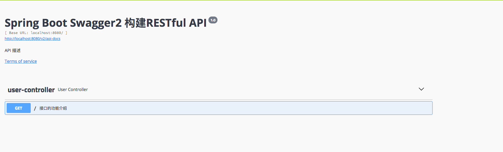
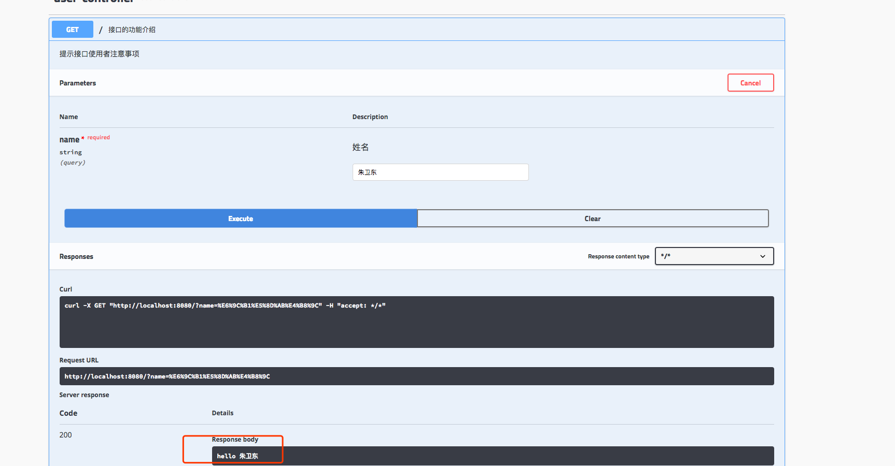

## springboot整合swagger2

swagger是一个方便后端编写接口文档的开源项目，并提供界面化测试。

### 项目搭建

- maven依赖
```xml
<!--swagger2-->
<dependency>
    <groupId>io.springfox</groupId>
    <artifactId>springfox-swagger2</artifactId>
    <version>2.8.0</version>
</dependency>
<dependency>
    <groupId>io.springfox</groupId>
    <artifactId>springfox-swagger-ui</artifactId>
    <version>2.8.0</version>
</dependency>
```

- 新建配置类
````java
@Configuration
@EnableSwagger2
public class Swagger2 {
    /**
     * 通过 createRestApi函数来构建一个DocketBean
     * 函数名,可以随意命名,喜欢什么命名就什么命名
     */
    @Bean
    public Docket createRestApi() {
        return new Docket(DocumentationType.SWAGGER_2)
                .apiInfo(apiInfo())//调用apiInfo方法,创建一个ApiInfo实例,里面是展示在文档页面信息内容
                .select()
                //控制暴露出去的路径下的实例
                //如果某个接口不想暴露,可以使用以下注解
                //@ApiIgnore 这样,该接口就不会暴露在 swagger2 的页面下
                .apis(RequestHandlerSelectors.basePackage("com.example.zwd.springbootswagger2.controller"))
                .paths(PathSelectors.any())
                .build();
    }
    //构建 api文档的详细信息函数
    private ApiInfo apiInfo() {
        return new ApiInfoBuilder()
                //页面标题
                .title("Spring Boot Swagger2 构建RESTful API")
                //条款地址
                .termsOfServiceUrl("http://despairyoke.github.io/")
                .contact("zwd")
                .version("1.0")
                //描述
                .description("API 描述")
                .build();
    }
}
````

- 新建测试controller类
````java
@RestController
public class UserController {

    @ApiOperation(value = "接口的功能介绍",notes = "提示接口使用者注意事项",httpMethod = "GET")
    @ApiImplicitParam(dataType = "string",name = "name",value = "姓名",required = true)
    @RequestMapping(value = "/")
    public String index(String name) {

        return "hello "+ name;
    }
}
````
启动项目[spring-boot-swagger2](./spring-boot-swagger2),访问 http://localhost:8080/swagger-ui.html 

可以看到下图效果



展开接口内部


点击try it out 输入姓名， Execute执行，返回如下图效果



[项目地址](./spring-boot-swagger2)