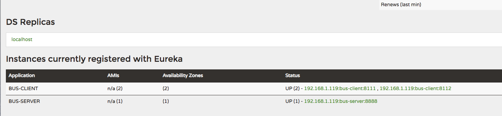
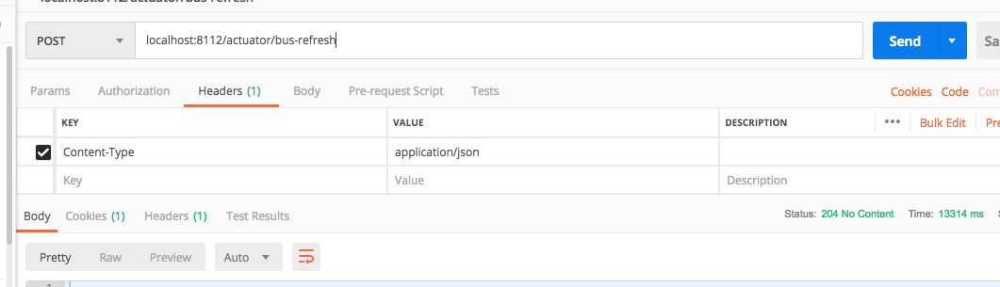

## Bus消息总线

### Bus简介
Spring Cloud Bus 将分布式的节点用轻量的消息代理连接起来。它可以用于广播配置文件的更改或者服务之间的通讯，也可以用于监控。
本文要讲述的是用Spring Cloud Bus实现通知微服务架构的配置文件的更改。

### 示例演示

功能说明，修改配置文件而不重启服务，进行刷新加载。

结合[config](./config.md) 我们对spring-cloud-config-server改造成我们sprign-cloud-bus

### 前期准备工作
- 和config相同，在config-repo下创建一个bus-client-dev.properties
```properties
foo = foo version 22
```
- 启动注册中心[spring-cloud-eureka](./spring-cloud-eureka)

### 服务端改造(增加eureka注册)
- 添加maven依赖（由于本次使用eureka）
```xml
<dependency>
    <groupId>org.springframework.cloud</groupId>
    <artifactId>spring-cloud-starter-netflix-eureka-client</artifactId>
</dependency>
```
- bootstrap.properties配置
```properties
spring.application.name=bus-server
server.port=8888

spring.cloud.config.server.git.uri=https://github.com/DespairYoke/java-advance
spring.cloud.config.server.git.search-paths=spring-cloud/config-repo
spring.cloud.config.server.git.username=username
spring.cloud.config.server.git.password=password

eureka.client.serviceUrl.defaultZone=http://localhost:8000/eureka/
```
- 启动类示例
```java
@SpringBootApplication
@EnableConfigServer
@EnableEurekaClient
public class SpringCloudBusApplication {

	public static void main(String[] args) {
		SpringApplication.run(SpringCloudBusApplication.class, args);
	}

}
```
### 客户端改造(重点)
- 添加消息总线和eureka依赖
```xml 
<dependency>
    <groupId>org.springframework.cloud</groupId>
    <artifactId>spring-cloud-starter-bus-amqp</artifactId>
</dependency>
<dependency>
    <groupId>org.springframework.cloud</groupId>
    <artifactId>spring-cloud-starter-netflix-eureka-client</artifactId>
</dependency>
<dependency>
    <groupId>org.springframework.boot</groupId>
    <artifactId>spring-boot-starter-actuator</artifactId>
</dependency>
```
此处使用amqp来做消息传播介质，也可使用kafaka。

- 添加bootstrap.properties配置属性
```properties
spring.application.name=bus-client

server.port=8111
spring.cloud.config.label=master

spring.cloud.config.uri=http://localhost:8888

spring.cloud.config.profile=dev

spring.rabbitmq.host=47.96.127.51
spring.rabbitmq.port=5672
spring.rabbitmq.username=springcloud
spring.rabbitmq.password=123456

spring.cloud.bus.enabled=true
## 开启消息跟踪
spring.cloud.bus.trace.enabled=true
## 启用bus-refresh的监控端点
management.endpoints.web.exposure.include=bus-refresh

eureka.client.serviceUrl.defaultZone=http://localhost:8000/eureka/
```
- 启动类示例
```java
@SpringBootApplication
@RestController
@EnableEurekaClient
@RefreshScope
public class SpringCloudBusClientApplication {

	public static void main(String[] args) {
		SpringApplication.run(SpringCloudBusClientApplication.class, args);
	}

	@Value(value = "${foo}")
	public String foo;

	@RequestMapping("/")
	public String home() {
		return "Hello World!"+foo;
	}
}
```

### 环境搭建完成
- 启动[spring-cloud-bus-server](./spring-cloud-bus-server)
- 启动[spring-cloud-bus-client](./spring-cloud-bus-client)
- 修改spring-cloud-bus-client配置文件，修改端口号为8112，再次启动项目

访问 http://localhost:8000/ ,查看注册中心信息。



访问http://localhost:8111/和http://localhost:8112/ 返回内容都是
```java
Hello World!foo version 33
```
修改`config-repo`下的`bus-client-dev.properties`内容。

`重点`：向8111或8112发送bus-refresh请求，不同版本请求路径可能有所不同，这里请求地址为 
http://localhost:8112/actuator/bus-refresh ，而且请求一定要是`post`请求才可以。如下



再次访问http://localhost:8111/和http://localhost:8112/ 返回内容都是
```java
Hello World!foo version 44
```
总结： 可见服务通过消息总线实现不重启更新配置文件，并且通知其他相关服务更新配置。