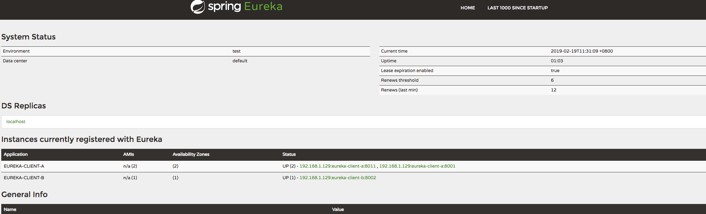
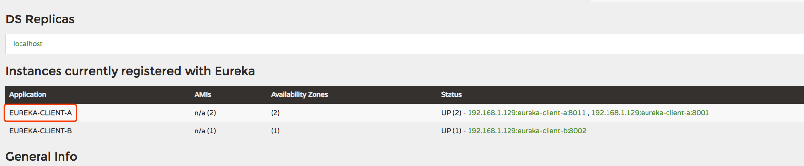

## Eureka注册中心

### eureka简介

eureka是Netflix开发的服务发现组件，本身是一个基于REST的服务。Spring Cloud将它集成在其子项目spring-cloud-netflix中，
以实现Spring Cloud的服务发现功能。eureka现在已经从1.0升级到2.0，可惜的是eureka2.0不在开源，但也不影响我们的使用。
由于基于REST服务，自然而然的就能想到，这个服务一定会有心跳检测、健康检查和客户端缓存等机制。

Eureka包括两个端：
- Eureka Server：注册中心服务端，用于维护和管理注册服务列表。
- Eureka Client：注册中心客户端，向注册中心注册服务的应用都可以叫做Eureka Client（包括Eureka Server本身）。

### eureka架构图


### 入门案例

#### Eureka Server

- 依赖介绍
    - spring-cloud-starter-netflix-eureka-server eureka服务端的标识，标志着此服务是做为注册中心
- application.properties配置
```properties
spring.application.name=eureka-server  //服务名称
server.port=8000            //服务端口

eureka.client.register-with-eureka=false  //自身不做为服务注册到注册中心

eureka.client.fetch-registry=false     //从注册表拉取信息

eureka.client.serviceUrl.defaultZone=http://localhost:8000/eureka/    服务注册地址
```
   
- 运行服务[spring-cloud-eureka](./spring-cloud-eureka)

- 运行成功后访问localhost:8000，会显示eureka提供的服务页面



#### Eureka Client

- 依赖介绍
    - spring-cloud-starter-netflix-eureka-client eureka客户端所需依赖。
    - spring-boot-starter-web web服务所需，内置tomcat服务器。
    
- application.properties配置
```properties
spring.application.name=eureka-client-a
server.port=8001

eureka.client.serviceUrl.defaultZone=http://localhost:8000/eureka/

```
- 运行服务[spring-cloud-clientA](./spring-cloud-clientA)

- 运行成功后访问localhost:8000，会显示eureka提供的服务页面



可以看到注册信息中有我们注册的服务信息。

    服务可以多次注册，只需修改服务的端口号即可。下面修改server.port=8011,再启动项目，会注册两个
    eureka-client-a用于后期负载均衡使用。

- 同样原理我们注册一个服务B，运行[spring-cloud-clientB](./spring-cloud-clientB)    


