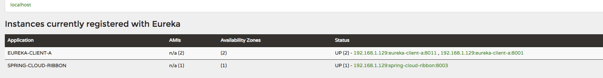

## ribbon负载均衡


Ribbon是一个基于HTTP和TCP客户端的负载均衡器。Feign中也使用Ribbon，后续会介绍Feign的使用。

###  准备工作

- 启动[spring-cloud-eureka](./spring-cloud-eureka)注册中心
- 启动[spring-cloud-clientA](./spring-cloud-clientA)
- 修改[spring-cloud-clientA](./spring-cloud-clientA)中的server.port为8011,再启动一个服务 spring-cloud-clienta

此时访问 http://localhost:8000/


可以看到COMPUTE-SERVICE服务有两个单元正在运行：

192.168.1.129:eureka-client-a:8011

192.168.1.129:eureka-client-a:8001

### ribbion服务搭建

#### 1、maven依赖
```xml
<dependency>
    <groupId>org.springframework.cloud</groupId>
    <artifactId>spring-cloud-starter-netflix-eureka-client</artifactId>
</dependency>
<dependency>
    <groupId>org.springframework.boot</groupId>
    <artifactId>spring-boot-starter-web</artifactId>
</dependency>
<dependency>
    <groupId>org.springframework.cloud</groupId>
    <artifactId>spring-cloud-starter-netflix-ribbon</artifactId>
</dependency>
```
#### 2、创建RestTemplate
```java
	@Bean
	@LoadBalanced
	RestTemplate restTemplate() {
		return new RestTemplate();
	}
```
只有配置了RestTemplate，ribbon才会自动配置成功。

#### 3、服务消费

```java
@Autowired
RestTemplate restTemplate;


@GetMapping(value = "ribbon")
public String add() {

    return restTemplate.getForEntity("http://EUREKA-CLIENT-A/hello?name=zwd",String.class).getBody();
}
```
#### 4、application.properties配置
```properties
spring.application.name=spring-cloud-ribbon
server.port=8003
eureka.client.serviceUrl.defaultZone=http://localhost:8000/eureka/
```

项目搭建完成，现在启动项目[spring-cloud-ribbon](./spring-cloud-ribbon)



多次访问 http://localhost:8003/ribbon，分别查看控制台输出信息
```properties
2019-02-19 19:00:07.622  INFO 3878 --- [nio-8001-exec-1] o.s.web.servlet.DispatcherServlet        : Initializing Servlet 'dispatcherServlet'
2019-02-19 19:00:07.630  INFO 3878 --- [nio-8001-exec-1] o.s.web.servlet.DispatcherServlet        : Completed initialization in 8 ms
hello zwd!
hello zwd!
```

```properties
2019-02-19 18:59:47.519  INFO 3885 --- [nio-8011-exec-1] o.s.web.servlet.DispatcherServlet        : Completed initialization in 8 ms
hello zwd!
hello zwd!
hello zwd!
hello zwd!
hello zwd!
hello zwd!
hello zwd!
```
可见两个服务负载均衡架构。