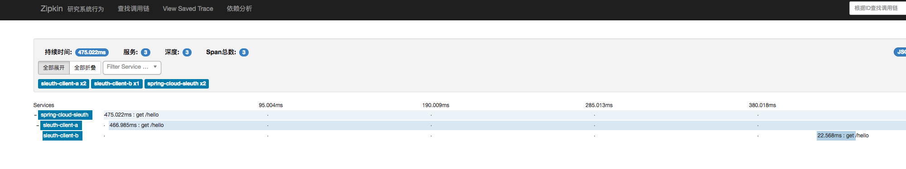
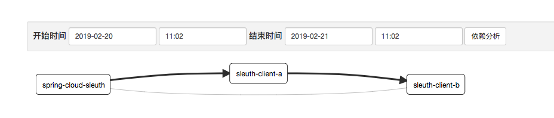

## Sleuth链路跟踪

### sleuth简介
随着业务的不断扩张，服务之间互相调用会越来越复杂。这时，如果想看一个请求的调用顺序是相当繁琐，所以引入sleuth记录调用请求。

### 前期准备

- zipkin的安装

        只需要下载jar即可，下载地址：    
        https://dl.bintray.com/openzipkin/maven/io/zipkin/java/zipkin-server/
        运行命令： java -jar zipkin-server-2.9.0-exec.jar
        成功后访问 http://localhost:9411 可以看到链路界面效果
        
### 构建工程

构建三个服务调用链供展示使用
#### spring-cloud-sleuth-server

- maven依赖
```xml
<dependency>
    <groupId>org.springframework.cloud</groupId>
    <artifactId>spring-cloud-starter-zipkin</artifactId>
</dependency>
```
- application.properties配置
```properties
server.port=8008
spring.zipkin.base-url=http://localhost:9411
spring.application.name=spring-cloud-sleuth
```
- 启动类示例
```java
@SpringBootApplication
@RestController
public class SpringCloudSleuthApplication {

	@Autowired
	private RestTemplate restTemplate;

	public static void main(String[] args) {
		SpringApplication.run(SpringCloudSleuthApplication.class, args);
	}

	@Bean
	public RestTemplate getRestTemplate(){
		return new RestTemplate();
	}

	@RequestMapping("/hello")
	public String callHome(){
		System.out.println("calling trace service-hi  ");
		return restTemplate.getForObject("http://localhost:8009/hello", String.class);
	}
	@Bean
	public Sampler defaultSampler() {
		return Sampler.ALWAYS_SAMPLE;
	}
}
```
可以看到我们访问 http://localhost:8008/hello时,向8009发送了一个请求，所有我们应该有个端口有8009的服务。

[spring-cloud-sleuth-clientA](./spring-cloud-sleuth-clientA)和[spring-cloud-sleuth-clientA](./spring-cloud-sleuth-clientB)代码和上述相同，不做代码展示。
直接启动这两个项目和[spring-cloud-sleuth-server](./spring-cloud-sleuth-server)

访问 http://localhost:8008/hello

打开zipkin页面




可以看到调用顺序，还有依赖关系。