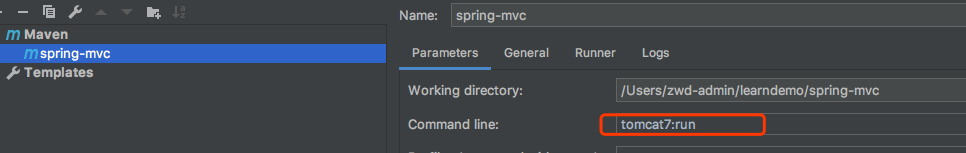

### 启动说明
本项目使用maven tomcat的插件进行启动，也可以打包放入tomcat中。

#### tomcat插件配置
```xml
<plugin>
    <groupId>org.apache.tomcat.maven</groupId>
    <artifactId>tomcat7-maven-plugin</artifactId>
    <version>2.1</version>
    <configuration>
        <!--<url>http://localhost:8080/data</url>-->
        <!--<server>tomcat7-local</server>-->
        <!--项目名称根路径-->
        <path>/my-spring-mvc</path>
    </configuration>

</plugin>
```
本人使用idea做为开发工具，这里展示idea配置过程。



启动成功即可访问。(如果没有tag 请看本人仓库原项目spring-mvc)

* tag v1.0.0 通过自定义反射实现mvc

* tag v1.0.1 基于编码替换web.xml

* tag v1.1.0 模拟spring mvc初始化web.xml和applicationContext.xml

* tag v2.0.0 可以正常使用，但不包含对redirect和forward的处理

* tag v2.0.1 增加对redirect和forward的处理

* tag v2.0.2 增加对请求参数的支持

* tag v2.0.3 增加对ModelAndView的支持