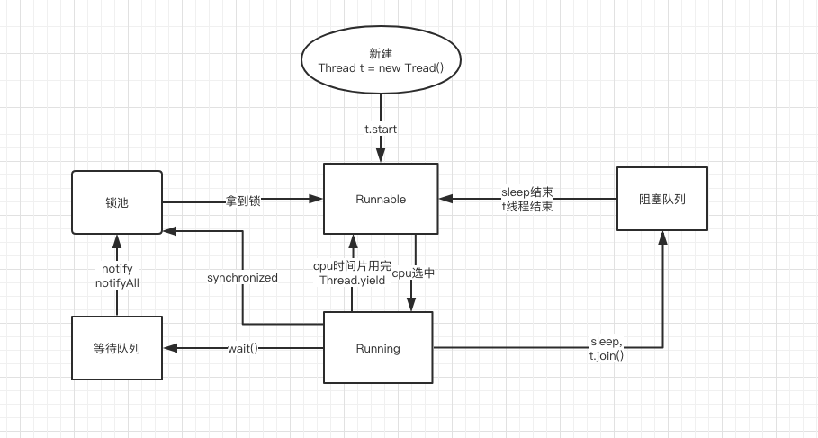

## 线程运行状态图



### 线程方法详解

#### join

- join简介
此线程加入当前线程，当前线程让进入阻塞队列，等待此线程完成。

- 示例代码
```java
public static void main(String[] args) throws InterruptedException {

    Thread t = new Thread(new Runnable() {
        @Override
        public void run() {
            try {
                Thread.sleep(2000);
            } catch (InterruptedException e) {
                e.printStackTrace();
            }
            System.out.println("i am "+Thread.currentThread());
        }
    });

    t.start();
//        t.join();
    System.out.println("i am "+Thread.currentThread());
}
```
先看下不启动`join`的执行结果。
```properties
i am Thread[main,5,main]
i am Thread[Thread-0,5,main]
```
经过结果可以看出，main线程并没等待t线程执行完成。下面解开注解看下效果。
```properties
i am Thread[Thread-0,5,main]
i am Thread[main,5,main]
```
从结果看出，main线程进入阻塞队列，一直等待着t线程执行结束才进入就绪队列。

### wait

- wait简介
从运行状态图上可以看出，当线程使用wait后，进入等待队列，等待其他线程将其唤醒。等待是为了解决消费者和提供者问题，所以
wait和notify必须有共享资源用来作为共同的桥梁。

- wait示例
```java
private static Object obj = new Object();
public static void main(String[] args) throws InterruptedException {
    
    //消费者
    Thread t = new Thread(new Runnable() {
        @Override
        public void run() {
            try {
                synchronized (obj){
                    System.out.println("等待通知唤醒");
                    obj.wait();
                    System.out.println("已被唤醒");
                }
            } catch (InterruptedException e) {
                e.printStackTrace();
            }
            System.out.println("i am "+Thread.currentThread());
        }
    });
    //生产者
    Thread t1 =new Thread(new Runnable() {
        @Override
        public void run() {

            synchronized(obj) {
                obj.notify();
                System.out.println("前往唤醒");
            }

            System.out.println("i am "+Thread.currentThread());
        }
    });
    t.start();
    Thread.sleep(2000);
    t1.start();
    t.join();
    t1.join();
    System.out.println("i am "+Thread.currentThread());
}

```

### sleep

线程的休眠是最常使用的函数，通过让线程的休眠来减慢线程的完成时间。

### yield

- 简介

当线程执行Thread中的yield（）静态方法是时候，如果此时具有同等优先级的其他线程就处于就绪状态了。
如果没有同等优先级的线程，那么yield（）方法什么也不做。这个方法只给同等优先级的线程机会，
对于其他的线程不管。

- 代码实例
````java
private static Object obj = new Object();
public static void main(String[] args) throws InterruptedException {

    //t
    Thread t = new Thread(new Runnable() {
        @Override
        public void run() {
             System.out.println("t线程开始让出cpu");
             Thread.yield();
            System.out.println("t线程执行完成");
        }
    });
    //t1
    Thread t1 =new Thread(new Runnable() {
        @Override
        public void run() {

            System.out.println("t1线程开始让出cpu");
            Thread.yield();

            System.out.println("t线程执行完成");
        }
    });
    t.start();
    t1.start();
    t.join();
    t1.join();
    System.out.println("i am "+Thread.currentThread());
}
````

