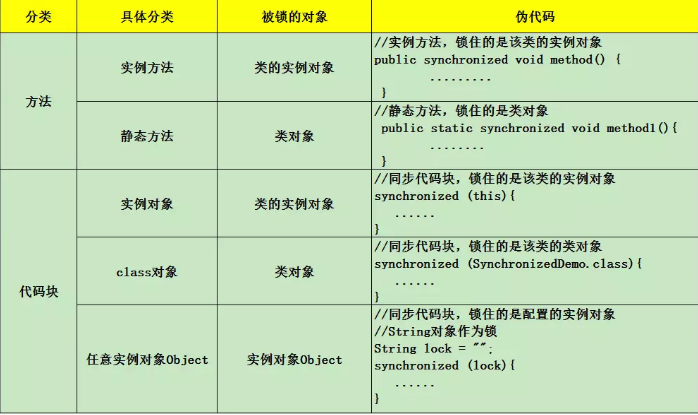
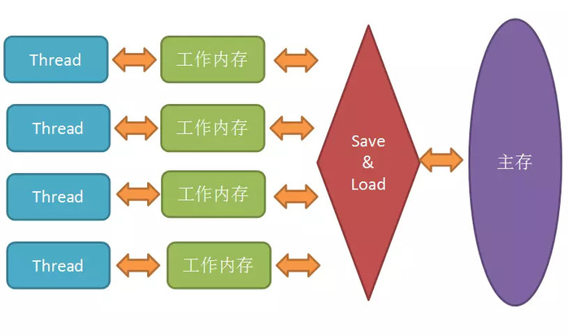
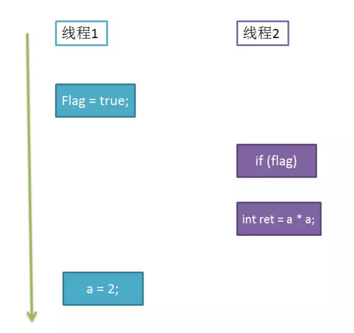

## 深度理解synchronized、volatile、cas

### synchronized实现原理
在java代码中使用synchronized可是使用在代码块和方法中，根据Synchronized用的位置可以有这些使用场景：



如图，synchronized可以用在方法上也可以使用在代码块中，其中方法是实例方法和静态方法分别锁的是该类的实例对象和该类的对象。
而使用在代码块中也可以分为三种，具体的可以看上面的表格。这里的需要注意的是：如果锁的是类对象的话，尽管new多个实例对象，
但他们仍然是属于同一个类依然会被锁住，即线程之间保证同步关系。

### volatile实现原理

- volatile的特性 
被volatile修饰的共享变量，就具有了以下两点特性：
    
        1.保证了不同线程对该变量操作的内存可见性;
        2.禁止指令重排序
        
#### 什么是内存可见性，什么又是重排序呢？
 Java虚拟机规范试图定义一种Java内存模型（JMM）,来屏蔽掉各种硬件和操作系统的内存访问差异，让Java程序在各种平台上都能达到一致的内存访问效果。
简单来说，由于CPU执行指令的速度是很快的，但是内存访问的速度就慢了很多，相差的不是一个数量级，所以搞处理器的那群大佬们又在CPU里加了好几层高速缓存。
在Java内存模型里，对上述的优化又进行了一波抽象。JMM规定所有变量都是存在主存中的，类似于上面提到的普通内存，每个线程又包含自己的工作内存，
方便理解就可以看成CPU上的寄存器或者高速缓存。所以线程的操作都是以工作内存为主，它们只能访问自己的工作内存，且工作前后都要把值在同步回主内存。
如下图：


在线程执行时，首先会从主存中read变量值，再load到工作内存中的副本中，然后再传给处理器执行，执行完毕后再给工作内存中的副本赋值，随后工作内存再把值传回给主存，
主存中的值才更新。 使用工作内存和主存，虽然加快的速度，但是也带来了一些问题。比如看下面一个例子：
```java
i = i + 1;
```
假设i初值为0，当只有一个线程执行它时，结果肯定得到1，当两个线程执行时，会得到结果2吗？这倒不一定了。可能存在这种情况：
```java
线程1： load i from 主存    // i = 0
        i + 1  // i = 1
线程2： load i from主存  // 因为线程1还没将i的值写回主存，所以i还是0
        i +  1 //i = 1
线程1:  save i to 主存
线程2： save i to 主存
```
如果两个线程按照上面的执行流程，那么i最后的值居然是1了。如果最后的写回生效的慢，你再读取i的值，都可能是0，这就是缓存不一致问题。 
下面就要提到你刚才问到的问题了，JMM主要就是围绕着如何在并发过程中如何处理原子性、可见性和有序性这3个特征来建立的，通过解决这三个问题，
可以解除缓存不一致的问题。而volatile跟可见性和有序性都有关。

#### 三大特性

* 1. 原子性(Atomicity)
Java中，对基本数据类型的读取和赋值操作是原子性操作，所谓原子性操作就是指这些操作是不可中断的，要做一定做完，要么就没有执行。 比如：
```java
i = 2;
j = i;
i++;
i = i + 1;
```
上面4个操作中，i=2是读取操作，必定是原子性操作，j=i你以为是原子性操作，其实吧，分为两步，一是读取i的值，然后再赋值给j,这就是2步操作了，
称不上原子操作，i++和i = i + 1其实是等效的，读取i的值，加1，再写回主存，那就是3步操作了。所以上面的举例中，最后的值可能出现多种情况，
就是因为满足不了原子性。 这么说来，只有简单的读取，赋值是原子操作，还只能是用数字赋值，用变量的话还多了一步读取变量值的操作。有个例外是
，虚拟机规范中允许对64位数据类型(long和double)，分为2次32为的操作来处理，但是最新JDK实现还是实现了原子操作的。 JMM只实现了基本的原子性，
像上面i++那样的操作，必须借助于synchronized和Lock来保证整块代码的原子性了。线程在释放锁之前，必然会把i的值刷回到主存的。
* 2. 可见性(Visibility)： 
    说到可见性，Java就是利用volatile来提供可见性的。 当一个变量被volatile修饰时，那么对它的修改会立刻刷新到主存，
 当其它线程需要读取该变量时，会去内存中读取新值。而普通变量则不能保证这一点。 其实通过synchronized和Lock也能够保证可见性，线程在释放锁之前，
 会把共享变量值都刷回主存，但是synchronized和Lock的开销都更大。 
* 3. 有序性（Ordering）
 JMM是允许编译器和处理器对指令重排序的，但是规定了as-if-serial语义，即不管怎么重排序，程序的执行结果不能改变。比如下面的程序段：
```java
double pi = 3.14;    //A
double r = 1;        //B
double s= pi * r * r;//C
```
上面的语句，可以按照A->B->C执行，结果为3.14,但是也可以按照B->A->C的顺序执行，因为A、B是两句独立的语句，而C则依赖于A、B，所以A、B可以重排序，
但是C却不能排到A、B的前面。JMM保证了重排序不会影响到单线程的执行，但是在多线程中却容易出问题。 比如这样的代码:
```java
int a = 0;
bool flag = false;

public void write() {
    a = 2;              //1
    flag = true;        //2
}

public void multiply() {
    if (flag) {         //3
        int ret = a * a;//4
    }
}
```
假如有两个线程执行上述代码段，线程1先执行write，随后线程2再执行multiply，最后ret的值一定是4吗？结果不一定：



如图所示，write方法里的1和2做了重排序，线程1先对flag赋值为true，随后执行到线程2，ret直接计算出结果，再到线程1，这时候a才赋值为2,很明显迟了一步。 
这时候可以为flag加上volatile关键字，禁止重排序，可以确保程序的`有序性`，也可以上重量级的synchronized和Lock来保证有序性,它们能保证那一块区域里的代码都是一次性执行完毕的。

#### volatile关键字如何满足并发编程的三大特性
其实就是如果一个变量声明成是volatile的，那么当我读变量时，总是能读到它的最新值，这里最新值是指不管其它哪个线程对该变量做了写操作，都会立刻被更新到主存里，
我也能从主存里读到这个刚写入的值。也就是说volatile关键字可以保证可见性以及有序性。 继续拿上面的一段代码举例：
```java
int a = 0;
bool flag = false;

public void write() {
   a = 2;              //1
   flag = true;        //2
}

public void multiply() {
   if (flag) {         //3
       int ret = a * a;//4
   }
}
```
这段代码不仅仅受到重排序的困扰，即使1、2没有重排序。3也不会那么顺利的执行的。假设还是线程1先执行write操作，
线程2再执行multiply操作，由于线程1是在工作内存里把flag赋值为1，不一定立刻写回主存，所以线程2执行时，multiply再从主存读flag值，
仍然可能为false，那么括号里的语句将不会执行。 如果改成下面这样：

````java
int a = 0;
volatile bool flag = false;

public void write() {
   a = 2;              //1
   flag = true;        //2
}

public void multiply() {
   if (flag) {         //3
       int ret = a * a;//4
   }
}
````
那么线程1先执行write,线程2再执行multiply。当写一个volatile变量时，JMM会把该线程对应的本地内存中的共享变量刷新到主内存 
当读一个volatile变量时，JMM会把该线程对应的本地内存置为无效，线程接下来将从主内存中读取共享变量。

#### volatile的两点内存语义能保证可见性和有序性，但是能保证原子性吗？

首先我回答是不能保证原子性，要是说能保证，也只是对单个volatile变量的读/写具有原子性，
但是对于类似volatile++这样的复合操作就无能为力了，比如下面的例子：
```java
public class Test {
    public volatile int inc = 0;
 
    public void increase() {
        inc++;
    }
 
    public static void main(String[] args) {
        final Test test = new Test();
        for(int i=0;i<10;i++){
            new Thread(){
                public void run() {
                    for(int j=0;j<1000;j++)
                        test.increase();
                };
            }.start();
        }
 
        while(Thread.activeCount()>1)  //保证前面的线程都执行完
            Thread.yield();
        System.out.println(test.inc);
    }
}
```
按道理来说结果是10000，但是运行下很可能是个小于10000的值。有人可能会说volatile不是保证了可见性啊，一个线程对inc的修改，
另外一个线程应该立刻看到啊！可是这里的操作inc++是个复合操作啊，包括读取inc的值，对其自增，然后再写回主存。
假设线程A，读取了inc的值为10，这时候被阻塞了，因为没有对变量进行修改，触发不了volatile规则。

  线程B此时也读到inc的值，主存里inc的值依旧为10，做自增，然后立刻就被写回主存了，为11。 此时又轮到线程A执行，由于工作内存里保存的是10，
所以继续做自增，再写回主存，11又被写了一遍。所以虽然两个线程执行了两次increase()，结果却只加了一次。 
有人说，volatile不是会使缓存行无效的吗？但是这里线程A读取到线程B也进行操作之前，并没有修改inc值，所以线程B读取的时候，
还是读的10。 又有人说，线程B将11写回主存，不会把线程A的缓存行设为无效吗？但是线程A的读取操作已经做过了啊，只有在做读取操作时，
发现自己缓存行无效，才会去读主存的值，所以这里线程A只能继续做自增了。
 
 综上所述，在这种复合操作的情景下，原子性的功能是维持不了了。但是volatile在上面那种设置flag值的例子里，由于对flag的读/写操作都是单步的，
所以还是能保证原子性的。 要想保证原子性，只能借助于synchronized,Lock以及并发包下的atomic的原子操作类了，
即对基本数据类型的 自增（加1操作），自减（减1操作）、以及加法操作（加一个数），减法操作（减一个数）进行了封装，
保证这些操作是原子性操作。

#### volatile底层的实现机制
如果把加入volatile关键字的代码和未加入volatile关键字的代码都生成汇编代码，会发现加入volatile关键字的代码会多出一个lock前缀指令。 
lock前缀指令实际相当于一个内存屏障，内存屏障提供了以下功能：

    1.重排序时不能把后面的指令重排序到内存屏障之前的位置 
    2.使得本CPU的Cache写入内存
    3.写入动作也会引起别的CPU或者别的内核无效化其Cache，相当于让新写入的值对别的线程可见。

#### 哪里会使用到volatile

- 1.状态量标记，就如上面对flag的标记，我重新提一下：
```java
int a = 0;
volatile bool flag = false;

public void write() {
    a = 2;              //1
    flag = true;        //2
}

public void multiply() {
    if (flag) {         //3
        int ret = a * a;//4
    }
}
```
这种对变量的读写操作，标记为volatile可以保证修改对线程立刻可见。比synchronized,Lock有一定的效率提升。

- 2.单例模式的实现，典型的双重检查锁定（DCL）
```java
class Singleton{
    private volatile static Singleton instance = null;
 
    private Singleton() {
 
    }
 
    public static Singleton getInstance() {
        if(instance==null) {
            synchronized (Singleton.class) {
                if(instance==null)
                    instance = new Singleton();
            }
        }
        return instance;
    }
}
```
这是一种懒汉的单例模式，使用时才创建对象，而且为了避免初始化操作的指令重排序，给instance加上了volatile。