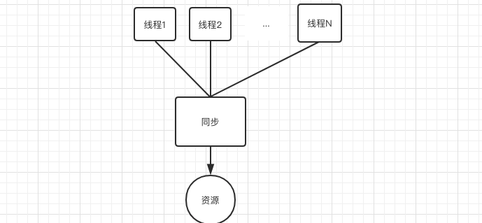
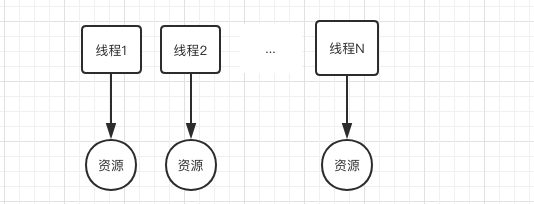

多线程访问同一个共享变量时特别容易出现并发问题，特别是在多个线程需要对一个共享变量进行写入时。为了保证线程安全，
一般使用者在访问共享变量时需要进行适当的同步，如图所示。



同步的措施一般是加锁，这就需要使用者对锁有一定的了解，这显然加重了使用者的负担。那么有没有一种方式可以做到，
当创建一个变量后，每个线程对其进行访问的时候访问的是自己线程的变量昵?其实ThreadLocal就可以做这件事情，
虽然ThreadLocal并不是为了解决这个问题而出现的。

如果你创建了一个ThreadLocal变量，那么访问这个变量的每个线程都会有一个本地副本。当多个线程操作时，实际是
操作自己本地内存里面的变量。



- 示例
```java
public class ThreadLocalApplication {

    static ThreadLocal<String> localVariable = new ThreadLocal<>();

    static void printdata(String str) {

        System.out.println(str+"："+ localVariable.get());
    }
    public static void main(String[] args) {

        Thread threadOne = new Thread(new Runnable() {
            @Override
            public void run() {

                localVariable.set("one");
                printdata("one");
            }

        });

        Thread threadTwo = new Thread(new Runnable() {
            @Override
            public void run() {

                localVariable.set("two");
                printdata("two");
            }

        });

        threadOne.start();
        threadTwo.start();
    }

}
```
解释：当线程threadOne调用localVariable时，会在线程内复制一个副本，所以无论怎么运行，one一直对应的都是one。

### 原理剖析

- 查看ThreadLocal.set源码
```java
public void set(T value) {
    Thread t = Thread.currentThread();
    ThreadLocalMap map = getMap(t);
    if (map != null)
        map.set(this, value);
    else
        createMap(t, value);
}

void createMap(Thread t, T firstValue) {
    t.threadLocals = new ThreadLocalMap(this, firstValue);
}
```
通过观察set源码，可以看出把当前线程做为`key`set中的`value`放到当前线程中的`ThreadLocal.ThreadLocalMap`中。

- 查看get源码
```java
public T get() {
    Thread t = Thread.currentThread();
    ThreadLocalMap map = getMap(t);
    if (map != null) {
        ThreadLocalMap.Entry e = map.getEntry(this);
        if (e != null) {
            @SuppressWarnings("unchecked")
            T result = (T)e.value;
            return result;
        }
    }
    return setInitialValue();
}
```

可以看出`value`值是根据线程做为key获得的，所以和其他线程并没有关系，不会发生并发冲突。
